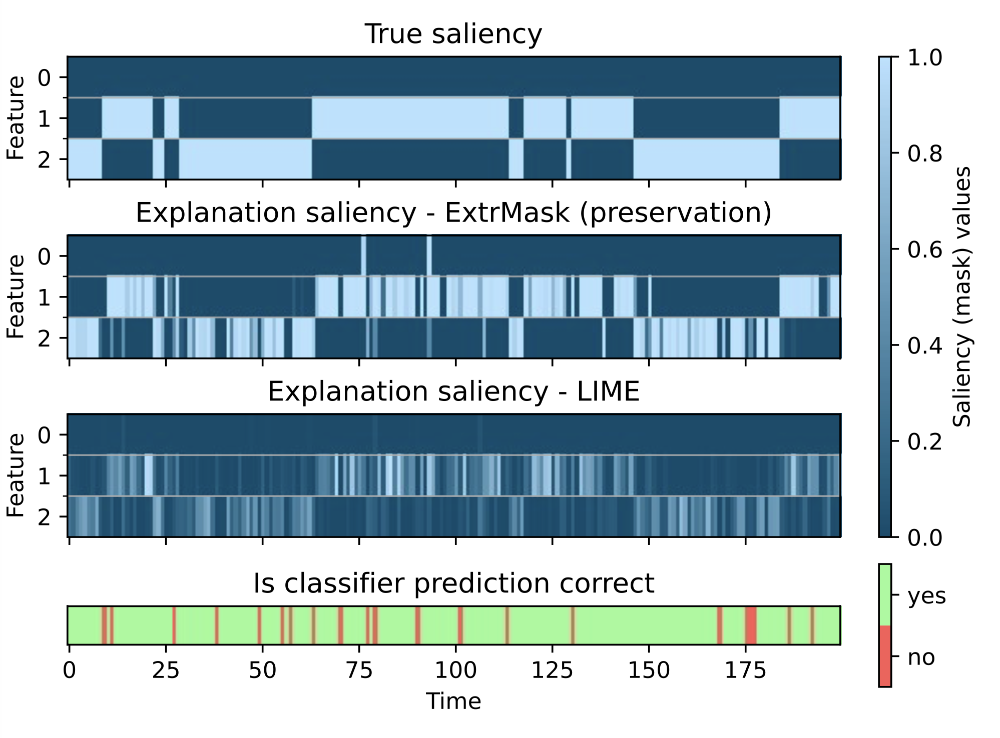
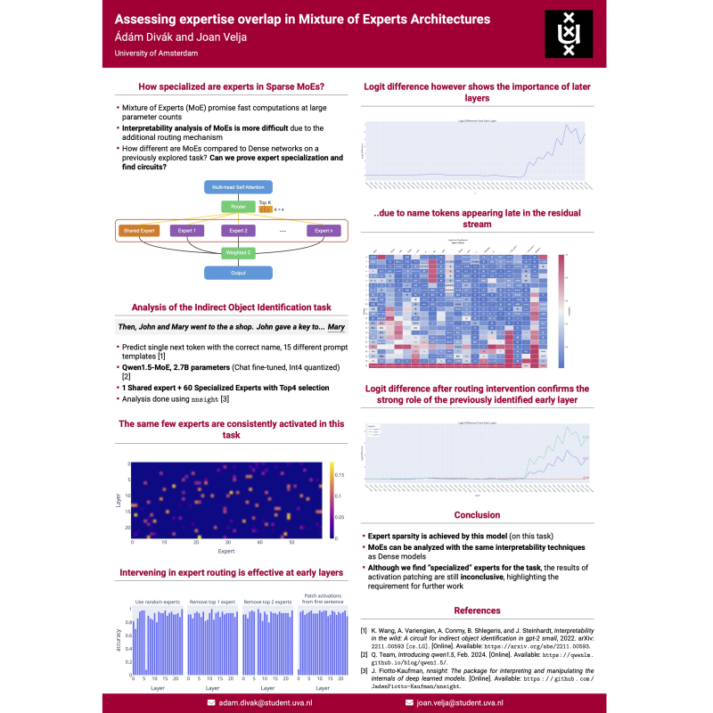
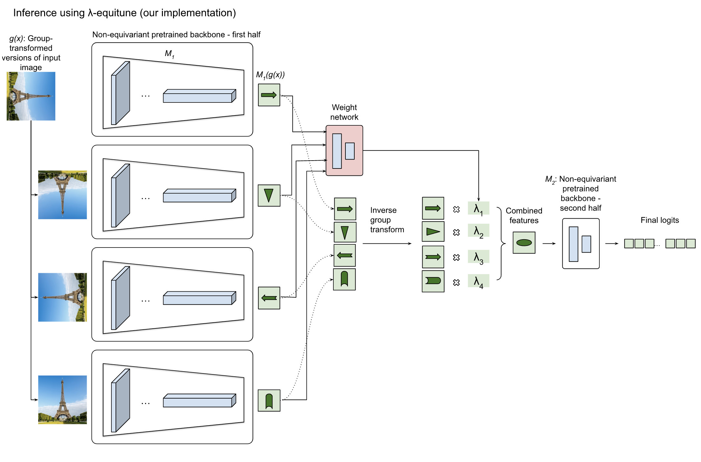
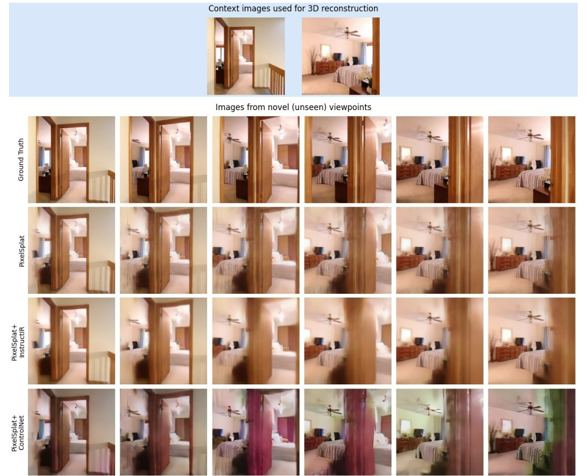

### Hi, I'm Adam,

I make sense of AI algorithms, develop software in C++ and Python, and lead engineering teams. Most recently I have worked on the prediction module of the highway autopilot system of [BMW](https://www.bmwgroup.com/en/innovation/automated-driving.html). Prior to that I led autonomous driving development at [AImotive](https://aimotive.com/) (acquired by [Stellantis](https://www.stellantis.com/en)), founded a small startup, and created a scientific conference administration system.

Currently I focus on studying AI full time at the University of Amsterdam. Check out my [CV](https://drive.google.com/file/d/1tvIknpUDykpwrTblMxDeawGgSM3IJsZP/view?usp=sharing) or [LinkedIn](https://www.linkedin.com/in/adamdivak/) for more information.

### Public projects

#### Academic projects
- **On the reproducibility of: "Learning Perturbation to Explain Time Series Predictions"** - Learning new alterations of time series signals to better explain what time series classification models focus on when making predictions ([poster @ NeurIPS 2024](https://neurips.cc/virtual/2024/poster/99345), [publication @ TMLR](https://openreview.net/forum?id=nPZgtpfgIx), [ML Reproducibility Challenge 2023](https://reproml.org/), [repo](https://github.com/adamdivak/time_interpret/tree/main))
- **Assessing expertise overlap in Mixture of Experts Architectures** - Interpretability analysis of a Mixture of Expert model with a focus on expert specialization ([poster](images/Assessing_Expertise_Overlap_in_MoE_models_poster.pdf))
- **(Even More) Efficient Equivariant Transfer Learning from Pretrained Models** - Exploring ways to introduce equivariance into large foundation models trained without it ([article](https://github.com/adamdivak/equivariant_transfer_learning/blob/main/Blogpost.md), [repo](https://github.com/adamdivak/equivariant_transfer_learning))
- **Improving novel view synthesis of 3D Gaussian splats using 2D image enhancement methods** - Evaluating the option of using diffusions models to improve the results of incorrect reconstructions from 3D Gaussian Splatting ([article](https://github.com/adamdivak/diffusion_augmented_pixelsplat/blob/main/CV2_Diffusion3DGS_Bant_Divak_Eppink_Feng_Hutter.pdf), [repo](https://github.com/adamdivak/diffusion_augmented_pixelsplat))

| <!-- -->    | <!-- -->    | <!-- -->    | <!-- -->    |
|-------------|-------------|-------------|-------------|
|  |  |  |  |

#### MOOC
I followed the [Udacity Self-Driving Car Engineer Nanodegree](https://www.udacity.com/course/self-driving-car-engineer-nanodegree--nd0013). Projects in the course cover all major parts of a self-driving software, some of which are here:

- **Planning** - Basic behavior and motion planning tested in Carla. State machine-based behavior planning, motion planning using cubic spirals, velocity profile generation and cost-function based trajectory selection with static collision checking ([repo](https://github.com/yosuah/udacity_sd_planning))
- **Control** - Control and trajectory tracking for AVs tested in Carla. Implementing separate PID controllers for throttle and steering, controller parameter tuning using the twiddle algorithm, and some fixes to the original planner and simulator client ([repo](https://github.com/yosuah/udacity_sd_control))
- **LIDAR-camera fusion** - Lidar-camera fusion with data association, track management and object tracking using an Extended Kalman Filter ([repo](https://github.com/yosuah/udacity_sd_lidar_fusion))
- **LIDAR detection** - Lidar 3D object detection using FPN ResNet, Darknet and Tensorflow using the Waymo Open Data Set ([repo](https://github.com/yosuah/udacity_sd_lidar_fusion))
- **Traffic sign detection** - Camera-based traffic sign classification with a classic CNN ([repo](https://github.com/yosuah/udacity_sd_traffic_sign_classification))
- **CV Lane detection 2** - Advanced lane detection using traditional CV algorithms. Calibration, birds-eye view perspective transformation, sliding windows based lane finding and temporal tracking ([repo](https://github.com/yosuah/udacity_sd_advanced_lanes_cv))
- **CV Lane detection 1** - Basic lane detection using traditional CV algorithms. Thresholding, Canny edge detection, line clustering using DBSCAN, ego lane separator selection and visualization ([repo](https://github.com/yosuah/udacity_sd_basic_lanes_cv))
